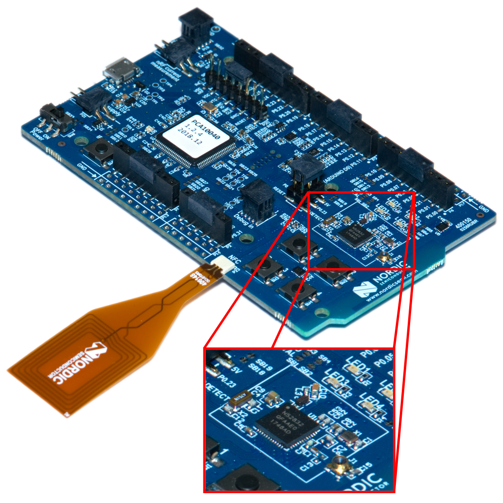

# Under the hood: Bare Metal Embedded Programming in C

[](https://circleci.com/gh/meriac/baremetal-c)

## Introduction & Scope

A single plain C file is sufficient to express the complete functionality of an embedded system. The [Arm Cortex-M architecture](http://infocenter.arm.com/help/index.jsp?topic=/com.arm.doc.dui0553a/index.html) is designed with C-Code in mind, no assembly-level system-bring-up-code is required.

This wokshop will teach you how to program C code on top of a bare metal CPU without an operating system or support libraries like libc. It will give you insight on how linkers can be configured to run your program at the right location and placing its data.

I will explain embedded programming using the free arm-gcc toolchain and related tools - starting from the toolchain to analyze the program on assembly level. I will also show how C-language maps to machine code depending on the chosen compiler optimization level and linker settings.

This workshop will further introduce you to low level features like stacks and interrupts, how they are used and how they map onto Arm assembly code. One of the purposes of this course is to lay out the programming methods for talking to hardware in a minimal configuration. My broader objective is teaching a better understanding of interaction with low level hardware and toolchains for embedded systems.

Last, but not least I will show debug techniques for low level OS-development and security features of the used microcontroller platform.

In case you’re interested in reading more material on the topic, I recommend reading [The Definitive Guide to ARM® Cortex®-M3 and Cortex®-M4 Processors](https://www.amazon.com/dp/0124080820), but it will be by no means required for participating in my course.

Basic knowledge of the C-programming language is required.

## Development Environment
			
In my workshop I am using Docker to provide a development environment containing an Arm cross compiler for the Cortex-M platform. Docker is usually included in most Linux distributions - please use your native package manager to install the latest Docker version. For Windows and Mac users you can download and install the latest Docker version [here](https://www.docker.com/get-started).

### Getting started on Linux and Mac

For launching the workshop Docker container and compiling this code, please enter the following commands in your terminal:
```bash
# Create a shared working directory between the Docker
# system and your host system. With this you can use
# your favourite editor to edit your code.
milosch:~ meri$ mkdir -p shared

# Run the toolchain system interactively
milosch:~ meri$ docker run -i -t -v $PWD/shared:/home/build/shared:Z meriac/arm-gcc
# ... Docker now automatically downloads and runs the toolchain system in an isolated Linux environment:
#	Unable to find image 'meriac/arm-gcc:latest' locally
#	latest: Pulling from meriac/arm-gcc
#	8e3ba11ec2a2: Pull complete 
#	bcd0627f7af9: Pull complete 
#	cd21453af7f6: Pull complete 
#	17a9fbb79b2f: Pull complete 
#	8a7ae6efea2c: Pull complete 
#	Digest: sha256:d0c68eacf51f7eb13a742c261af8ed7401404f07b37872f56056961fc21efdac
#	Status: Downloaded newer image for meriac/arm-gcc:latest

build@585b29ddac9d:~$ cd shared/
build@585b29ddac9d:~/shared$ git clone https://github.com/meriac/baremetal-c
#
#	Cloning into 'baremetal-c'...
#	remote: Counting objects: 112, done.
#	remote: Compressing objects: 100% (36/36), done.
#	remote: Total 112 (delta 13), reused 35 (delta 6), pack-reused 68
#	Receiving objects: 100% (112/112), 1.06 MiB | 1.91 MiB/s, done.
#	Resolving deltas: 100% (29/29), done.

build@d4f04152103b:~/shared$ cd baremetal-c/Lesson\ 01\ -\ Hello\ Blinky/
build@d4f04152103b:~/shared/baremetal-c/Lesson 01 - Hello Blinky$ make
#	arm-none-eabi-gcc -mcpu=cortex-m4 -mthumb -Og -I../Common/Include -I../Common/Include/CMSIS5 -fno-common -g3 -Wall -Werror -Wextra   -c -o blinky.o blinky.c
#	arm-none-eabi-gcc -mcpu=cortex-m4 -mthumb -T../Common/Linker/minimal.ld -nostartfiles -nostdlib -lnosys -o blinky.elf blinky.o
#	arm-none-eabi-objdump -S blinky.elf > blinky.asm
#	arm-none-eabi-objcopy blinky.elf -O binary blinky.bin
#	rm blinky.elf blinky.o

build@d4f04152103b:~/shared/baremetal-c/Lesson 01 - Hello Blinky$ ls -l blinky.bin 
#	-rwxr-xr-x    1 build    wheel           68 Aug 19 15:50 blinky.bin
```

## Hardware Development Kit

For my lessons I am using the 
[nRF52 Development Kit](https://infocenter.nordicsemi.com/index.jsp?topic=%2Fcom.nordic.infocenter.nrf52%2Fdita%2Fnrf52%2Fdevelopment%2Fnrf52_dev_kit.html) for the 
[nRF52832 CPU](https://infocenter.nordicsemi.com/pdf/nRF52832_PB_v2.0.pdf) from Nordic Semiconductors which is [available everywhere](https://www.nordicsemi.com/eng/Buy-Online?search_token=nRF52-DK). The [nRF52832 datasheet](http://infocenter.nordicsemi.com/pdf/nRF52832_PS_v1.4.pdf) is publicly available and well written.

### Development Kit Features

- [nRF52832](https://infocenter.nordicsemi.com/pdf/nRF52832_PS_v1.4.pdf) system-on-a-chip solution
	- 32-bit ARM Cortex-M4F Processor
	- Integrated a 2.4GHz Bluetooth Low Energy (BLE) interface
	- Very power efficient, can run many years from coincell battery
	- Hardware floating point support
	- 512kB flash + 64kB RAM
	- AES hardware encryption builtin
	- Many integrated hardware peripherals: 3x SPI, 2x I²C, UART, 3x PWM, ADC, RTC, PDM
- Buttons and LEDs for user interaction
- Integrated [SEGGER J-Link debugger](https://www.segger.com/downloads/jlink/#J-LinkSoftwareAndDocumentationPack) with debug out functionality
	- Virtual COM port interface via UART
	- Drag-and-drop mass storage device (MSD) programming
- Supporting 13.56 MHz NFC-A RFID tag emuation mode
- I/O interface for Arduino form factor plug-in modules (2.54mm headers)

### Overview

Below you can see the development kit - the largest part of the devlopment kit is occupied by the debug interface. The actual system running the lessons code is just the one black chip within the white square.
The antenna for the Bluetooth Low Energy functionality is located underneath the printed URL below the NORDIC-logo at right side of the board. 




